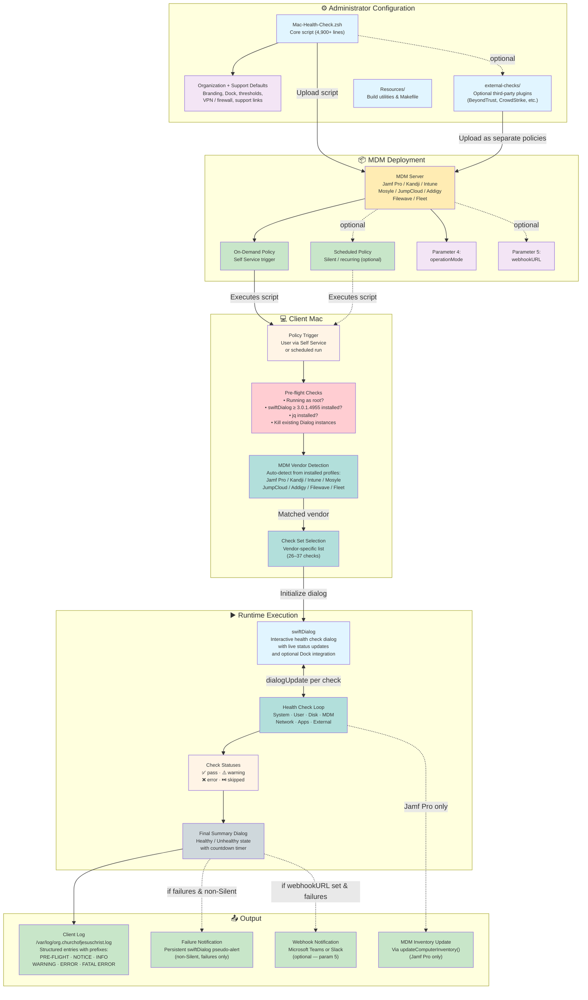

# Mac Health Check: System Architecture

This diagram shows the `3.2.0` Mac Health Check ecosystem, from administrator customization through MDM deployment, client-side execution, user interaction, and results output.

---

## Component Descriptions

### Administrator Configuration

**`Mac-Health-Check.zsh`**
The single deployable artifact (4,900+ lines). Contains the health check logic, swiftDialog UI layer, Dock handling, logging helpers, webhook delivery, and vendor-specific branching. Administrators typically customize the **Organization Variables** and **IT Support Variables** sections before uploading it to MDM.

**Organization + Support Defaults**
Key settings administrators configure before deployment:
- `organizationBrandingBannerURL` / `organizationOverlayiconURL` — Branding
- `enableDockIntegration` / `dockIcon` — Dock launch behavior and badge icon
- `vpnClientVendor` — VPN type (`paloalto`, `cisco`, `tailscale`, `none`)
- `organizationFirewall` — Firewall type (`socketfilterfw` or `pf`)
- `allowedMinimumFreeDiskPercentage` — Free disk threshold
- `allowedUptimeMinutes` — Uptime warning threshold
- `supportLabel1`–`supportLabel6` / `supportValue1`–`supportValue6` — Dynamic support lines and Info button target
- `completionTimer` — Dialog auto-close delay

**`external-checks/`**
Optional plugin scripts for third-party tools (BeyondTrust, Cisco Umbrella, CrowdStrike Falcon, GlobalProtect). Each plugin is uploaded to MDM as a separate policy and writes results to a shared defaults domain (`organizationDefaultsDomain`) for the main script to read.

---

### MDM Deployment

Mac Health Check is MDM-agnostic and has been tested with eight MDM platforms. The script is uploaded as a policy script and executed with two optional parameters:

- **Parameter 4 (`operationMode`)** — Intended production default is `Self Service`; other supported modes are `Silent`, `Debug`, `Development`, and `Test`
- **Parameter 5 (`webhookURL`)** — Optional Microsoft Teams or Slack webhook URL used when unhealthy runs need to post a failure summary

---

### Client Mac

**Pre-flight Checks**
The script validates its environment before running any health checks:
1. Confirms execution as root
2. Verifies `jq` is installed
3. Checks for swiftDialog ≥ 3.0.1.4955 (installs from GitHub if missing)
4. Kills any existing swiftDialog instances

**MDM Vendor Detection**
The script inspects installed configuration profiles to identify the MDM vendor, then selects the appropriate health check set (26–37 checks depending on vendor capabilities).

---

### Runtime Execution

Health checks execute sequentially, with each result posted to the swiftDialog dialog via a named pipe (`dialogUpdate`). When Dock integration is enabled, non-`Silent` runs also show a Dock icon with a decreasing badge count. Checks report one of four statuses: **pass**, **warning**, **error**, or **skipped**. After all checks complete, a final summary dialog appears with a countdown timer, and non-`Silent` runs with failures also trigger a persistent swiftDialog pseudo-alert notification.

---

### Output

**Client Log** — Every run writes structured log entries to `/var/log/org.churchofjesuschrist.log` using prefixed log levels (`[PRE-FLIGHT]`, `[NOTICE]`, `[INFO]`, `[WARNING]`, `[ERROR]`, `[FATAL ERROR]`). Logs include computer name, serial number, user, OS version, and all check results.

**Failure Notification** — When a non-`Silent` run detects failures, `displayFailureNotification()` presents a persistent swiftDialog pseudo-alert listing the failed health checks and offering a support link.

**Webhook** — When configured, a summary of failed checks is posted to Microsoft Teams or Slack at the end of each unhealthy run. Jamf Pro deployments include a direct link to the computer record.

**MDM Inventory** — Jamf Pro deployments include `updateComputerInventory()` as the final Jamf-specific check.
