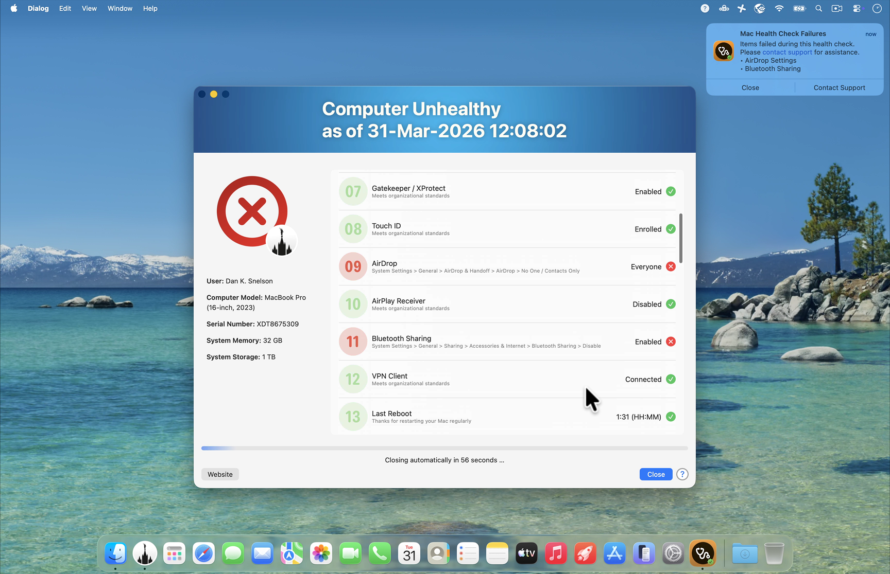
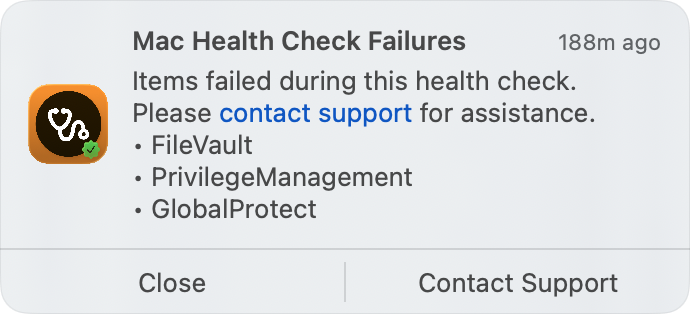
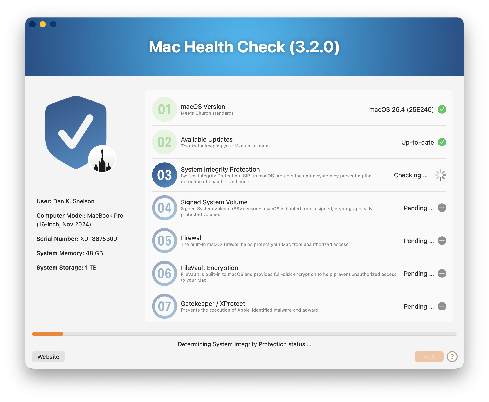
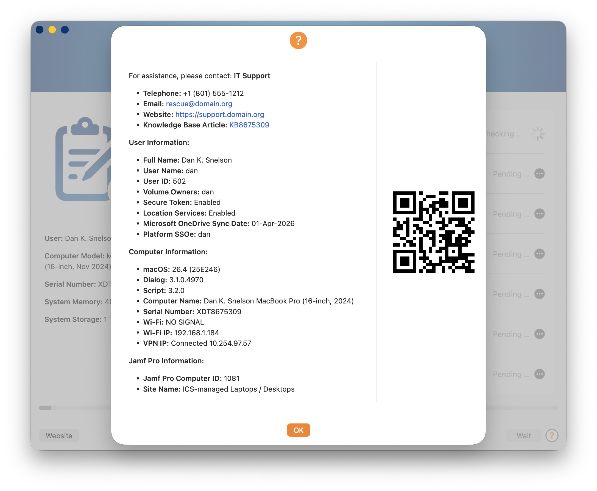
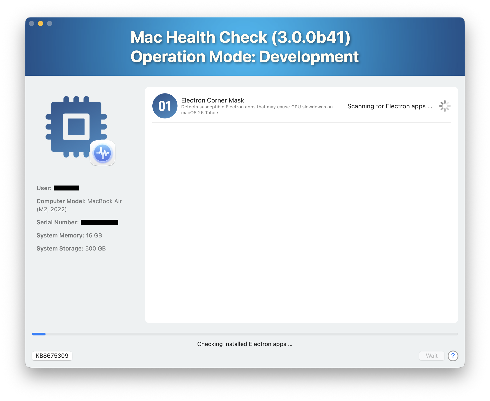
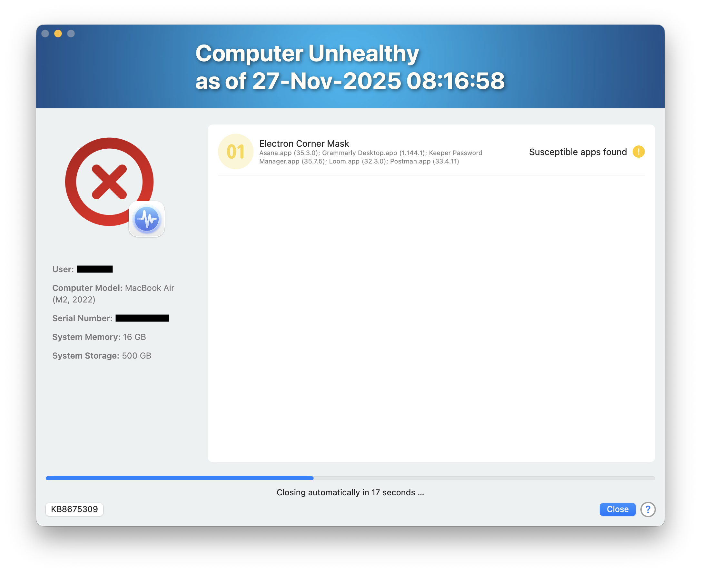

     

# Mac Health Check (3.2.0)

> Another pleasant update to the practical, MDM-agnostic, user-friendly approach to surfacing Mac compliance information directly to end-users via your MDM's self-service app



## Overview

Mac Health Check provides a practical, MDM-agnostic, user-friendly approach to surfacing Mac compliance information directly to end-users via an MDM's Self Service.

Built using the open-source utility [swiftDialog](https://github.com/swiftDialog/swiftDialog/wiki), the solution acts as a “heads-up display” that presents real-time system health and policy compliance status in a clear and interactive format.

Deployment of Mac Health Check involves configuring organizational defaults, embedding the script in your MDM, creating a policy to run it on demand and testing to ensure proper output and behavior.

Administrators can customize the user interface using swiftDialog’s visual capabilities, making the experience both informative and approachable.

The tool logs results for review, while not altering device configuration, and a new "Silent" Operation Mode makes Mac Health Check ideal for IT visibility without end-user intrusion.

<a href="https://www.youtube.com/watch?v=rDPoYlSSEtQ&t=36s" target="_blank"><br />Rocketman Tech December 2025 Meetup</a> (05-Dec-2025)

## Use Cases

Mac Health Check is particularly valuable in IT support workflows, serving as an initial triage point for Tier 1 support by confirming network access, credentials, and MDM connectivity, while also acting as a verification tool for Tier 2 teams both during and after remediation efforts.

### Step Zero for Tier 1

- User has a working Internet connection
- User knows their directory credentials
- Mac can execute policies
- Validates Network Access Controls

### Step Ninety-nine for Tier 2

- Initial assessment for support sessions
- Easily confirms remediation efforts
- Provides peace-of-mind for end-users

### Silent Mode

- Silently performs all health checks and logs results
- No dialog is presented to the end-user
- Ideal for background compliance reporting
- Complements existing MDM compliance frameworks

### Dock Integration

- Non-`Silent` modes launch swiftDialog with `--showdockicon` and `--dockicon`
- `dockIcon` is configurable and supports `default`, local paths, `file://` paths and `http(s)` URLs
- Mac Health Check copies `Dialog.app` to `/Library/Application Support/Dialog/${humanReadableScriptName}.app` and launches `dialogcli` from that bundle so Dock hover text matches the script name
- `dockiconbadge` shows the number of remaining checks, decreases after each completed check and is removed when checks complete
- If dock icon setup fails, Mac Health Check logs a warning and falls back to the default `/usr/local/bin/dialog` launch path

## Features
The following health checks and information reporting are included in version `3.2.0`, which operates in `Self Service` mode by default. (Change `operationMode` to `Debug`, `Development` or `Test` when getting ready to deploy in production.)

> :new: Mac Health Check version `3.2.0` introduces a new persistent notification of failed health checks, which remains visible until user-dismissed
 


### Health Checks

<<<<<<< HEAD


1. macOS Version
1. Available Updates (including deferred and DDM-enforced updates)
=======


:tada: Improved in version `3.2.0`

1. macOS Version
1. :tada: Available Updates (including deferred and DDM-enforced updates)
>>>>>>> 6c81f0c951d50cb76b24cc87fbdc53fa30832c55
1. System Integrity Protection
1. Signed System Volume (SSV)
1. Firewall
1. FileVault Encryption
1. Gatekeeper / XProtect
<<<<<<< HEAD
1. Touch ID :new:
1. VPN Client
1. Last Reboot
1. Free Disk Space
=======
1. Touch ID
1. Password Hint
1. AirDrop
1. AirPlay Receiver
1. Bluetooth Sharing
1. VPN Client
1. Last Reboot
1. :tada: Free Disk Space
>>>>>>> 6c81f0c951d50cb76b24cc87fbdc53fa30832c55
1. User's Directory Size and Item Count
    - Desktop
    - Downloads
    - Trash
1. MDM Profile
1. MDM Certificate Expiration
1. Apple Push Notification service
1. Jamf Pro Check-in
1. Jamf Pro Inventory
1. Extended Network Checks
    - Apple Push Notification Hosts
    - Apple Device Management
    - Apple Software and Carrier Updates
    - Apple Certificate Validation
    - Apple Identity and Content Services
<<<<<<< HEAD
    - Jamf Hosts
1. Electron Corner Mask :new: [:link:](https://github.com/electron/electron/pull/48376)
=======
    - :tada: Jamf Hosts
1. App Auto-Patch
1. Electron Corner Mask [🔗](https://avarayr.github.io/shamelectron/)
>>>>>>> 6c81f0c951d50cb76b24cc87fbdc53fa30832c55
1. Organizationally required Applications (i.e., Microsoft Teams)
1. BeyondTrust Privilege Management*
1. Cisco Umbrella*
1. CrowdStrike Falcon*
1. Palo Alto GlobalProtect*
1. Network Quality Test
1. :tada: Update Computer Inventory**

*Requires [external check](/external-checks/README.md)
**Requires Jamf Pro

### Information Reporting

<<<<<<< HEAD

=======

>>>>>>> 6c81f0c951d50cb76b24cc87fbdc53fa30832c55

#### IT Support
- Dynamic `supportLabel1` / `supportValue1` through `supportLabel6` / `supportValue6`
- Empty Label / Value pairs are skipped automatically
- Legacy fallback still works when all dynamic pairs are empty:
  - Telephone (`supportTeamPhone`)
  - Email (`supportTeamEmail`)
  - Website (`supportTeamWebsite`)
  - Knowledge Base Article (`supportKBURL`)
- Info button target now uses the first URL-like dynamic support value; if none is found, it falls back to legacy Knowledge Base values

#### User Information
- Full Name
- User Name
- User ID
- Volume Owners
- Secure Token
- Location Services
- Microsoft OneDrive Sync Date
- Platform Single Sign-on Extension

#### Computer Information
- macOS version (build)
- System Memory
- System Storage
- Dialog version
- Script version
- Computer Name
- Serial Number
- Wi-Fi SSID
- Wi-FI IP Address
- VPN IP Address

#### Jamf Pro Information**
- Site

***[Payload Variables for Configuration Profiles](https://learn.jamf.com/en-US/bundle/jamf-pro-documentation-11.18.0/page/Computer_Configuration_Profiles.html#ariaid-title2)

### Policy Log Reporting

```
<<<<<<< HEAD
MHC (2.6.0): 2025-11-06 03:43:13 - [NOTICE] WARNING: 'localadmin' IS A MEMBER OF 'admin';
=======
MHC (3.2.0): 2026-03-28 03:43:13 - [NOTICE] WARNING: 'localadmin' IS A MEMBER OF 'admin';
>>>>>>> 6c81f0c951d50cb76b24cc87fbdc53fa30832c55
User: macOS Server Administrator (localadmin) [503] staff everyone localaccounts _appserverusr 
admin _appserveradm com.apple.sharepoint.group.4 com.apple.sharepoint.group.3
com.apple.sharepoint.group.1 _appstore _lpadmin _lpoperator _developer _analyticsusers
com.apple.access_ftp com.apple.access_screensharing com.apple.access_ssh com.apple.access_remote_ae
com.apple.sharepoint.group.2; Bootstrap Token supported on server: YES;
Bootstrap Token escrowed to server: YES; sudo Check: /etc/sudoers: parsed OK;
sudoers: root  ALL = (ALL) ALL %admin  ALL = (ALL) ALL ; Platform SSOe: localadmin NOT logged in;
Location Services: Enabled; SSH: On; Microsoft OneDrive Sync Date: Not Configured;
Time Machine Backup Date: Not configured; localadmin's Desktop Size: 160M for 116 item(s);
localadmin's Trash Size: 1.8M for 3 item(s); Battery Cycle Count: 0; Wi-Fi: Liahona;
Ethernet IP address: 17.113.201.250; VPN IP: 17.113.201.250; 
Network Time Server: time.apple.com; Jamf Pro Computer ID: 007; Site: Servers
```

1. Warning when logged-in user is a member of `admin`
1. Deferred Software Updates
1. Logged-In User Group Membership
1. Security Mode
1. DEP-allowed MDM Control
1. Activation Lock
1. Bootstrap Token
1. sudoers
1. Kerberos SSOe
1. Location Services
1. SSH
1. Time Machine
1. Battery Cycle Count
1. Network Time Server
1. Jamf Pro Computer ID

## Support

<a href="https://slack.com/app_redirect?channel=C0977DRT7UY" target="_blank"></a>

Community-supplied, best-effort support is available on the [Mac Admins Slack](https://www.macadmins.org/) (free, registration required) [#mac-health-check Channel](https://slack.com/app_redirect?channel=C0977DRT7UY), or you can open an [issue](https://github.com/dan-snelson/Mac-Health-Check/issues).

## Deployment

<a href="https://snelson.us/mhc" target="_blank"></a><br />
Deployment of Mac Health Check involves configuring organizational defaults, uploading the script to your MDM server, creating a policy to run it on demand and testing to ensure proper output and behavior.

<a href="https://snelson.us/mhc" target="_blank">Continue reading …</a>

## Operation Mode: Development

A new "Development" Operation Mode has been added to aid in developing Health Checks, allowing the easy execution of a _single_ Health Check.




When `operationMode` is set to `Development`, a dedicated `developmentListitemJSON` is used to allow developers to focus on specific checks, instead of running the entire suite.

```zsh
####################################################################################################
#
# Program
#
####################################################################################################

# # # # # # # # # # # # # # # # # # # # # # # # # # # # # # # # # # # # # # # # # # # # # # # # # #
# Generate dialogJSONFile based on Operation Mode and MDM Vendor
# # # # # # # # # # # # # # # # # # # # # # # # # # # # # # # # # # # # # # # # # # # # # # # # # #

if [[ "${operationMode}" == "Development" ]]; then
    
    notice "Operation Mode is ${operationMode}; using ${operationMode} dialogJSONFile template."

    # Development List Items

    developmentListitemJSON='
    [
        {"title" : "AirDrop", "subtitle" : "Ensure AirDrop is not set to Everyone for security", "icon" : "SF=17.circle,'"${organizationColorScheme}"'", "status" : "pending", "statustext" : "Pending …", "iconalpha" : 0.5},
        {"title" : "Jamf Hosts","subtitle":"Test connectivity to Jamf Pro cloud and on-prem endpoints","icon":"SF=28.circle,'"${organizationColorScheme}"'", "status":"pending","statustext":"Pending …", "iconalpha" : 0.5},
        {"title" : "Free Disk Space", "subtitle" : "Checks for the amount of free disk space on your Mac’s boot volume", "icon" : "SF=12.circle,'"${organizationColorScheme}"'", "status" : "pending", "statustext" : "Pending …", "iconalpha" : 0.5},
        {"title" : "Desktop Size and Item Count", "subtitle" : "Checks the size and item count of the Desktop", "icon" : "SF=13.circle,'"${organizationColorScheme}"'", "status" : "pending", "statustext" : "Pending …", "iconalpha" : 0.5},
        {"title" : "Downloads Size and Item Count", "subtitle" : "Checks the size and item count of the Downloads folder", "icon" : "SF=14.circle,'"${organizationColorScheme}"'", "status" : "pending", "statustext" : "Pending …", "iconalpha" : 0.5},
        {"title" : "Trash Size and Item Count", "subtitle" : "Checks the size and item count of the Trash", "icon" : "SF=15.circle,'"${organizationColorScheme}"'", "status" : "pending", "statustext" : "Pending …", "iconalpha" : 0.5}
    ]
    '
    # Validate developmentListitemJSON is valid JSON
    if ! echo "$developmentListitemJSON" | jq . >/dev/null 2>&1; then
        echo "Error: developmentListitemJSON is invalid JSON"
        echo "$developmentListitemJSON"
        exit 1
    else
        combinedJSON=$( jq -n --argjson dialog "$mainDialogJSON" --argjson listitems "$developmentListitemJSON" '$dialog + { "listitem": $listitems }' )
    fi

else
```

Additionally, the matching Health Check functions are executed:

```zsh
# # # # # # # # # # # # # # # # # # # # # # # # # # # # # # # # # # # # # # # # # # # # # # # # # #
# Generate Health Checks based on Operation Mode and MDM Vendor (where "n" represents the listitem order)
# # # # # # # # # # # # # # # # # # # # # # # # # # # # # # # # # # # # # # # # # # # # # # # # # #

if [[ "${operationMode}" == "Development" ]]; then
    
    # Operation Mode: Development
    notice "Operation Mode is ${operationMode}; using ${operationMode}-specific Health Check."
    dialogUpdate "title: ${humanReadableScriptName} (${scriptVersion})<br>Operation Mode: ${operationMode}"
    checkAirDropSettings "0"
    checkNetworkHosts "1" "Jamf Hosts" "${jamfHosts[@]}"
    checkFreeDiskSpace "2"
    checkUserDirectorySizeItems "3" "Desktop" "desktopcomputer.and.macbook" "Desktop"
    checkUserDirectorySizeItems "4" "Downloads" "arrow.down.circle.fill" "Downloads"
    checkUserDirectorySizeItems "5" ".Trash" "trash.fill" "Trash"

else
```
